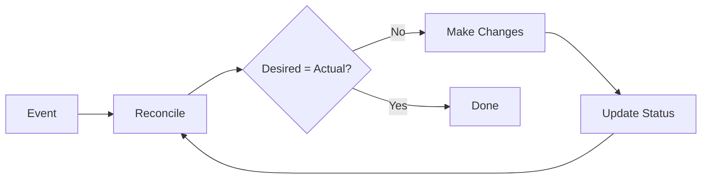

golint-sl includes three analyzers for Kubernetes controller development: `reconciler`, `statusupdate`, and `sideeffects`. This page explains the patterns they enforce.

## The Reconciliation Loop

Kubernetes controllers use a reconciliation pattern:



The key properties:

1. **Idempotent**: Running reconcile twice produces the same result
2. **Level-triggered**: Responds to current state, not events
3. **Status reflects reality**: Status always matches actual state

## reconciler Analyzer

The `reconciler` analyzer checks for common controller anti-patterns.

### Result Handling

```go
// Bad: Ignoring the result
func (r *Reconciler) Reconcile(ctx context.Context, req ctrl.Request) (ctrl.Result, error) {
    // ... reconciliation ...
    return ctrl.Result{}, nil  // Always succeeds? Suspicious.
}

// Good: Proper result handling
func (r *Reconciler) Reconcile(ctx context.Context, req ctrl.Request) (ctrl.Result, error) {
    obj := &myv1.MyResource{}
    if err := r.Get(ctx, req.NamespacedName, obj); err != nil {
        if apierrors.IsNotFound(err) {
            return ctrl.Result{}, nil  // Object deleted, nothing to do
        }
        return ctrl.Result{}, err  // Retry with backoff
    }

    if needsWork(obj) {
        if err := r.doWork(ctx, obj); err != nil {
            return ctrl.Result{RequeueAfter: time.Minute}, err  // Retry later
        }
    }

    return ctrl.Result{}, nil
}
```

### Requeue Patterns

```go
// Bad: Infinite tight loop
return ctrl.Result{Requeue: true}, nil

// Good: Explicit backoff
return ctrl.Result{RequeueAfter: 30 * time.Second}, nil

// Good: Let controller-runtime handle backoff
return ctrl.Result{}, err
```

## statusupdate Analyzer

The `statusupdate` analyzer ensures reconcilers update status after making changes.

### Why Status Updates Matter

Status is how Kubernetes resources communicate their state:

```yaml
apiVersion: myapp.io/v1
kind: MyResource
metadata:
  name: example
spec:
  replicas: 3
status:
  readyReplicas: 2    # Current state
  conditions:
    - type: Ready
      status: "False"
      reason: "ScalingUp"
      message: "Waiting for 1 more replica"
```

Without status updates:

- Users can't see what's happening
- Other controllers can't coordinate
- Debugging becomes impossible

### Pattern: Always Update Status

```go
func (r *Reconciler) Reconcile(ctx context.Context, req ctrl.Request) (ctrl.Result, error) {
    obj := &myv1.MyResource{}
    if err := r.Get(ctx, req.NamespacedName, obj); err != nil {
        return ctrl.Result{}, client.IgnoreNotFound(err)
    }

    // Track the original status for comparison
    originalStatus := obj.Status.DeepCopy()

    // Do reconciliation work
    result, err := r.reconcile(ctx, obj)

    // Always update status if changed
    if !reflect.DeepEqual(originalStatus, &obj.Status) {
        if statusErr := r.Status().Update(ctx, obj); statusErr != nil {
            return ctrl.Result{}, statusErr
        }
    }

    return result, err
}
```

### Pattern: Status Conditions

```go
import "k8s.io/apimachinery/pkg/api/meta"

func (r *Reconciler) reconcile(ctx context.Context, obj *myv1.MyResource) (ctrl.Result, error) {
    // Set condition based on state
    condition := metav1.Condition{
        Type:               "Ready",
        Status:             metav1.ConditionTrue,
        ObservedGeneration: obj.Generation,
        LastTransitionTime: metav1.Now(),
        Reason:             "ReconcileSucceeded",
        Message:            "All resources are ready",
    }

    if err := r.doWork(ctx, obj); err != nil {
        condition.Status = metav1.ConditionFalse
        condition.Reason = "ReconcileFailed"
        condition.Message = err.Error()
    }

    meta.SetStatusCondition(&obj.Status.Conditions, condition)
    return ctrl.Result{}, nil
}
```

## sideeffects Analyzer

The `sideeffects` analyzer uses SSA (Static Single Assignment) analysis to detect side effects in reconcilers.

### Why Track Side Effects?

Reconcilers should be idempotent, but side effects can break this:

```go
// Dangerous: Non-idempotent side effect
func (r *Reconciler) reconcile(ctx context.Context, obj *myv1.MyResource) error {
    // If this runs twice, you get two webhooks!
    if err := r.sendWebhook(obj); err != nil {
        return err
    }
    return nil
}
```

### Pattern: Track Side Effects

```go
func (r *Reconciler) reconcile(ctx context.Context, obj *myv1.MyResource) error {
    // Check if side effect already happened
    if obj.Status.WebhookSent {
        return nil
    }

    if err := r.sendWebhook(obj); err != nil {
        return err
    }

    // Record that side effect happened
    obj.Status.WebhookSent = true
    return nil
}
```

### Pattern: Finalizers for Cleanup

```go
const finalizerName = "myapp.io/cleanup"

func (r *Reconciler) Reconcile(ctx context.Context, req ctrl.Request) (ctrl.Result, error) {
    obj := &myv1.MyResource{}
    if err := r.Get(ctx, req.NamespacedName, obj); err != nil {
        return ctrl.Result{}, client.IgnoreNotFound(err)
    }

    // Handle deletion
    if !obj.DeletionTimestamp.IsZero() {
        if controllerutil.ContainsFinalizer(obj, finalizerName) {
            // Do cleanup side effects
            if err := r.cleanup(ctx, obj); err != nil {
                return ctrl.Result{}, err
            }

            // Remove finalizer after cleanup
            controllerutil.RemoveFinalizer(obj, finalizerName)
            if err := r.Update(ctx, obj); err != nil {
                return ctrl.Result{}, err
            }
        }
        return ctrl.Result{}, nil
    }

    // Add finalizer if missing
    if !controllerutil.ContainsFinalizer(obj, finalizerName) {
        controllerutil.AddFinalizer(obj, finalizerName)
        if err := r.Update(ctx, obj); err != nil {
            return ctrl.Result{}, err
        }
    }

    return r.reconcile(ctx, obj)
}
```

## Common Anti-Patterns

### 1. Forgetting NotFound Check

```go
// Bad: Logs error on normal deletion
if err := r.Get(ctx, req.NamespacedName, obj); err != nil {
    return ctrl.Result{}, err
}

// Good: Ignore NotFound
if err := r.Get(ctx, req.NamespacedName, obj); err != nil {
    return ctrl.Result{}, client.IgnoreNotFound(err)
}
```

### 2. Updating Spec and Status Together

```go
// Bad: Updates both spec and status
obj.Spec.Something = "new"
obj.Status.Ready = true
r.Update(ctx, obj)  // Status change may be lost!

// Good: Separate updates
obj.Spec.Something = "new"
r.Update(ctx, obj)

obj.Status.Ready = true
r.Status().Update(ctx, obj)
```

### 3. Not Handling Conflicts

```go
// Bad: Fails on conflict
if err := r.Update(ctx, obj); err != nil {
    return ctrl.Result{}, err
}

// Good: Retry on conflict
if err := r.Update(ctx, obj); err != nil {
    if apierrors.IsConflict(err) {
        return ctrl.Result{Requeue: true}, nil
    }
    return ctrl.Result{}, err
}
```

### 4. Blocking in Reconcile

```go
// Bad: Blocking call in reconcile
resp, err := http.Get("https://external-service.com/api")  // Could take forever!

// Good: Use context with timeout
ctx, cancel := context.WithTimeout(ctx, 10*time.Second)
defer cancel()

req, _ := http.NewRequestWithContext(ctx, "GET", "https://external-service.com/api", nil)
resp, err := http.DefaultClient.Do(req)
```

## Disabling for Non-Kubernetes Projects

If you're not building Kubernetes controllers:

```yaml
# .golint-sl.yaml
analyzers:
  reconciler: false
  statusupdate: false
  sideeffects: false
```

## Further Reading

- [Kubernetes Controllers](https://kubernetes.io/docs/concepts/architecture/controller/)
- [controller-runtime Book](https://book.kubebuilder.io/)
- [Operator SDK](https://sdk.operatorframework.io/)

## Next Steps

- [Reference: reconciler](/reference/analyzers/reconciler) - Detailed analyzer docs
- [Reference: statusupdate](/reference/analyzers/statusupdate) - Status update requirements
- [Reference: sideeffects](/reference/analyzers/sideeffects) - Side effect detection
